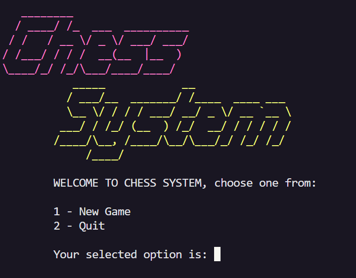

# Chess System Project
[](https://opensource.org/licenses/MIT)


This repository is a unpretentious program that allows the user play chess in terminal. 

This project was developed during a java course with only academic goals: apply and improve the acquired knowledge, such as the java basics, object-oriented programming, and best practices.


## Requirements

- A terminal that accepts ANSI escape code. Windows users may have a terminal emulator or IDE of choice. Examples: WSL, GNOME Terminal, Hyper, IntelliJ and VSCode.
- Java Runtime Environment (JRE) v8 or higher, you can download it [here](https://www.java.com/pt-BR/download/).

## Building/Installation

To run the game, clone the repository as follows: <br>
```bash
 $ git clone git@github.com:gmessiasc/ChessSystem-Java.git
```

Then, you will need to compile it.

You can use javac to compile the main program in: 
```bash
src/application/Program.java
```

or simply use your favourite IDE for it.

## Running

To start the game, you will need to run the file ```Program.class``` into a colorful terminal (that accepts ANSI CODE).<br>
Examples of terminals I use in windows: WSL, Hyper, GNOME, or IDE Terminals such IntelliJ or Visual Code Studio.

Probably, this file will be found in ```out/prouction/ChessProject/application/Program.class```

Into ChessProject directory, you can run it with:<br>
```bash
$ java application/Program
```

If everything is alright, it will open the console menu as the screenshot below:



Then input the respective number of options.<br>
"1" and press enter for start the game Player vs Player.<br>
"2" and press enter for start the game Player vs CPU (in development).<br>
"3" and press enter for finish the program.

If you choose "1" the match will start as the screenshot below:


## Rules

1. The board have columns (that are represented by letters between **'a'** and **'h'**) and rows (that are represented by numbers between **'1'** and **'8'**).
2. There are White Pieces (upcase letters with white background), and Black Pieces (upcase yellow letters with black background).
3. Each player must control only one color-type of piece during the match, and can move one piece each turn.
4. To move a piece you must select it inputting the respective column-row. For example, if you want to move the piece **'P'** in the first column (a) and second row (2), you must input Source: ```a2```.
5. After select a piece, it will show for you the available moves. Then you must input the target movement, selecting the column-row available to do it. For example Target: ```a4```.
6. We have six different types of pieces, with singular movements, and we can capture our opponent pieces.
7. The player wins only when he reaches the checkmate (capture the opponent king piece, represented by letter **'K'**).

### Pieces Glossary

- **P**: is the piece PAWN.
- **R**: is the piece ROOK.
- **N**: is the piece KNIGHT.
- **B**: is the piece BISHOP.
- **Q**: is the piece QUEEN.
- **K**: is the piece KING.

### Pieces Movements

- The **KING** may move one square in any direction, as long no piece is blocking his path.
- The **QUEEN** may move any number of squares straight or diagonally in any direction.
- The **ROOK** may move any number of squares horizontally or vertically.
- The **BISHOP** may move any number of squares diagonally.
- The only piece that can jump over a piece - be it your own, or the opponent's - is the: **KNIGHT**. The Knight can jump to any square in L shape.
- The **PAWN** on its first move may move either one or two squares straight forward. After its first move the Pawn may only advance one square at a time. The Pawn captures by moving diagonally one square forward in each direction. The Pawn cannot move or capture backwards. 

### Special Rules

- **Castling:**  The King moves two squares in the direction of the Rook, the Rook jumps over the King and lands on the square next to it.
- **En passant:**  A pawn is able to capture a horizontally adjacent enemy pawn that has just advanced two squares in one move.
- **Pawn promotion:** When a pawn reaches to its last rank, it transforms into a new piece of player's choose: a Queen, rook, bishop or knight of the pawn's color.

### License

This project is licensed under the terms of the MIT license.